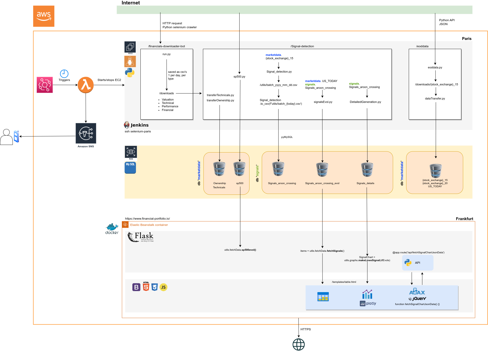

The full and expanded version of this project is private.</br>
Please contact alexnesovic@getthesignals.com for further information.
</br>

Deployment w. AWS Beanstalk. Backend w. AWS RDS MySQL. Server running with Flask (Python, Bootstrap, HTML, CSS, JavaScript, incl. JQuery and AJAX routines). Connects to different market data API's. Gathers and synthetizes the data. Will synthesize and display the competitive arenas for every chosen stock.
The app integrates a user authentication procedure.

<h4> Command to create virtual env (VS code, Ubuntu 20) </h4>
<p>In <strong>project root dir</strong> open command line:</p>

```
python3 -m venv .sversus
source .sversus/bin/activate
```

To initiate db (cutover), run:

```python3 db_create.py```
<h4> Infrastructure </h4>




<h4> To do: </h4>

<ul>
	<li>Portfolio builder, also have evol for a set of tickers for a given holding period</li>
	<li>Option chains integration</li>
	<li>Put/call ratio integration</li>
	<li>Peers Seekingalpha</li>
    	<li>RTVS detector + visualization of normality</lI>
    	<li>API connection w. EC2 to check infra. health</li>
	<li>Macro sector & industry cycles in macro pages</li>
	<li>Implement a more granular scale than the current price tri-partition in /table page</li>
</ul>


<h4>(Windows)Personnal issues encountered and turnaroud:</h4>

<p>https://stackoverflow.com/questions/57018186/cant-activate-environment-from-visual-studio-code</p>

<ul>
	<li>ctrl + shift +p find the settings.json, append two rows: "python.terminal.activateEnvironment": true, "terminal.integrated.shell.windows": "C:\WINDOWS\System32\cmd.exe",</li>
	<li>choose to run the task in the terminal</li>
</ul>

<h4> Dockerization of the app </h4> </br>
In the app folder, run the following command: </br>
<code>docker run -it --name gts -p 5000:5000 -v ${PWD}:/app python:3.7 bash</code>
</br>
<code>pip install -r requirements.txt</code>
</br>
</br>
Start specific container after exit: </br>
<code>docker start `docker ps -a -q --filter "name=gts"`</code>
</br>
To get into a Docker container's shell:</br>
<code>docker exec -it gts bash</code>
</br>
Stop all containers:
<code>docker stop $(docker ps -aq)</code></br>
</br>


Building the image:</br>
<code>docker build -t gts .</code>
</br>
Running the image:</br>
<code>docker run -e aws_db_endpoint='<DNS>' -e aws_db_pass='<password>' -e aws_db_user='<password>' -p 5000:5000 gts</code>
</br>
</br>
Other useful instructions:</br>
<code>docker container ls</code></br>
<code>docker image ls</code></br>
Purging All Unused or Dangling Images, Containers, Volumes, and Networks:
<code>docker system prune -a</code></br>


<h4> General considrations about Docker</h4>
<ul>
<li>A Dockerfile is a recipe for creating Docker images</li>
<li>A Docker image gets built by running a Docker command (which uses that Dockerfile)</li>
<li>A Docker container is a running instance of a Docker image</li>
</ul>
</br>

<h5> Regarding the AWS deployment, to zip the new versions to upload</h5>
Inside the root directory run the following command:</br>
<code>zip -r package.zip * .ebextensions</code></br>

To debug static files issue (css):</br>
https://stackoverflow.com/questions/15077489/static-assets-dont-show-up-for-flask-on-elastic-beanstalk

Regarding big files upload towards S3:</br>
https://aws.amazon.com/premiumsupport/knowledge-center/s3-large-file-uploads/
